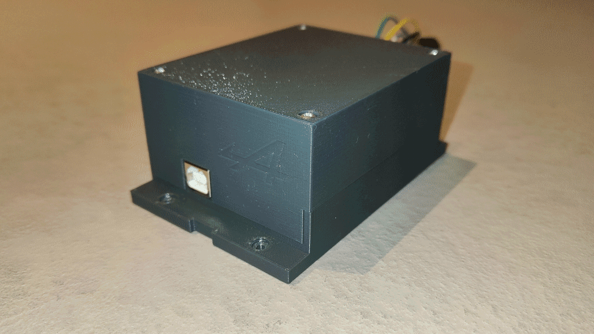
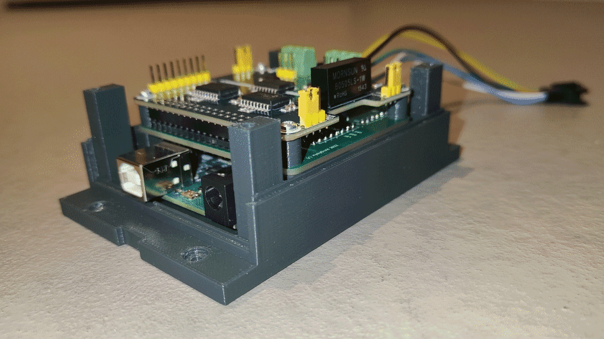
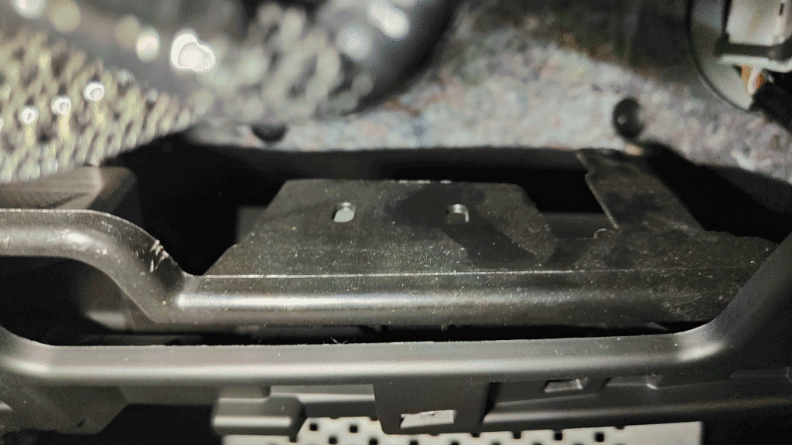
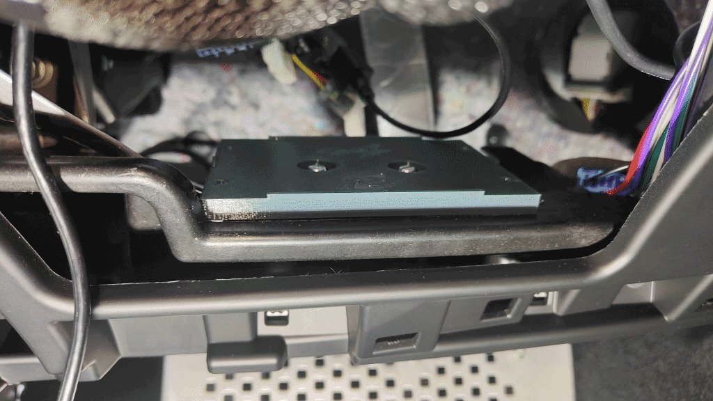
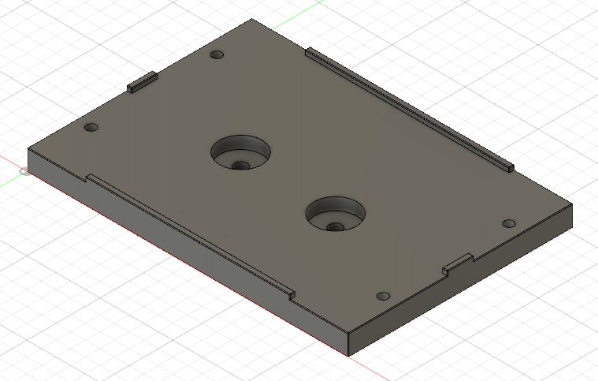
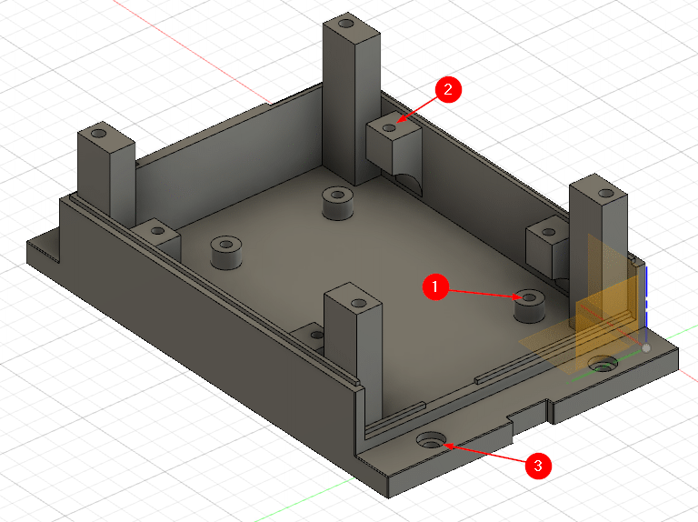
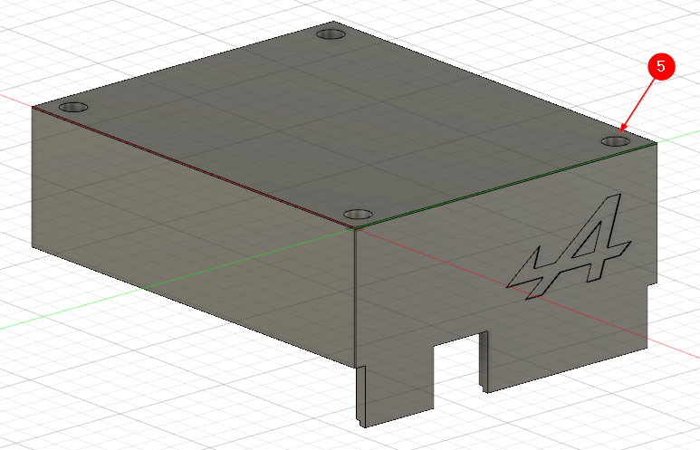
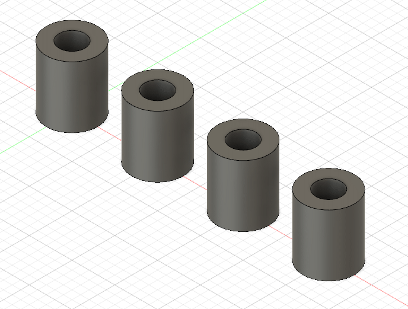

# Boitier MyAlpDroid

##  Présentation

Ce boitier permet d'installer les 3 cartes électroniques du projet. Elles sont toutes maintenues mécaniquement et pas seulement via les connecteurs.

Le boitier se fixe sous l'emplacement du poste :

A l'aide d'une platine de fixation :

## Modèles 3D

1 - Platine de fixation

Insérer en force 4 ecrous de 3 sur la face inférieure

2 - Partie inférieure du boitier

(1) Fixation de la carte arduino à l'aide de Vis PVC de 2,5 x 6
(2) Fixation de la carte DAV42 et de la carte CAN à l'aide de Vis PVC de 2,5 x 16 (entretoises à placer entre les 2 cartes)
(3) Fixation du boitier sur la platine par 4 vis de 3 x 10

3 - Partie Supérieure du boitier

(4) - Vis d'assemblage des 2 parties du boitiers : Vis PVC de 3 x 16

4 - Entretoises

Entretoises à placer entre la carte DAV42 et la carte CAN

