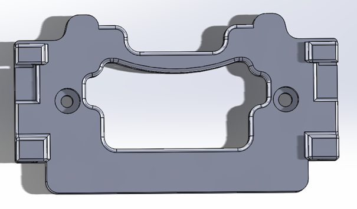
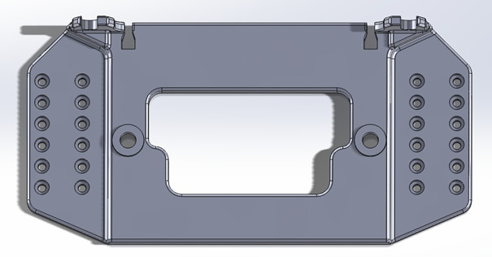
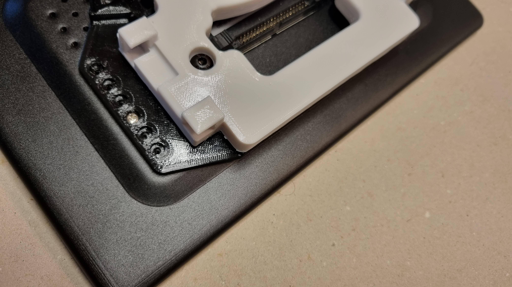
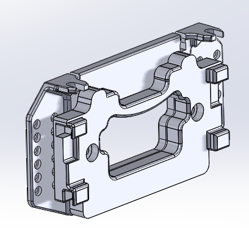
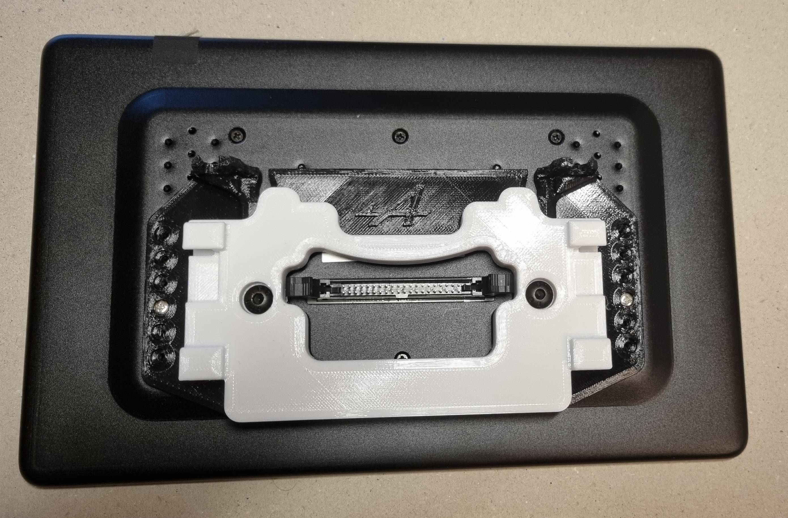
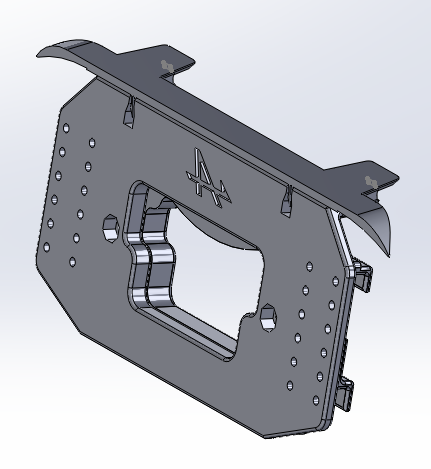

# Support tablette réalisé en impression 3D

## Présentation et installation

Voici une solution de montage de la tablette Joying en lieu et place du poste multimédia Alpine. Le support utilisé est réalisé en impressin 3D. Il est fixé sur la tablette Joying et reprend la fixation du poste Alpine.

Cette proposition est un prototype qui fonctionne parfaitement. Il a été testé sur plusieurs voitures, fonctionne parfaitement et répond au besoin. Bien sûrn n'hésitez pas à me faire des retours et j'essaierai dans la mesure du possible de le faire évoluer.

**Toutefois, et comme l'avait mentionné PHIL03 à l'origine de ce projet fantastique, veuillez noter qu'il s'agit d'un projet expérimental et qu'il peut y avoir des dysfonctionnements. Vous utilisez les résultats de ce projet à vos propres risques et périls, l'auteur n'assurera aucun support ou garantie suite à l'utilisation des solutions proposées dans ce projet.**

Cette solution se compose de 3 éléments:

1. l'interface de fixation

Cette interface s'emboîte sur les 4 ergots situés dans le renfoncement derrière l'ancien poste Alpine.

2. l'entretoise support de tablette

Cette entretoise se fixe sur l'arrière de la tablette Joying à l'aides vis de fixation livrées avec la tablette. Cette entretoise est ensuite fixée sur l'interface précédente.

3. le cache misère

Cette petite pièce s'emboite dans les pièces précédentes pour cacher le jour entre la tablette Joying et le tableau de bord. Notez qu'elle comporte 2 petits volets qui se positionnent au dessus des vis de fixation de l'ancien poste et remplacent les caches originaux. 

## Réalisation des éléments

Ce sont de simples pièces en polymère qui peuvent être imprimées sur des imprimantes 3D grand public. Il existe très certainement dans votre entourage des gens équipés des machines nécessaires, ou de fablab capables de réaliser de réaliser ces pièces, moyennant des coûts très faibles (à titre d'exemple, il me faut une douzaine d'heures pour imprimer cxes pièces usr une machine PRUSA, et l'ensemble me revient à quelques € de matière). Il existe également des services sur le net, qui réaliseront ces pièces, de façon professionnelle, et pour un coût qui sera un peu plus élevé mais qui restera raisonnable. 

**Toutefois je souhaite attirer votre attention sur le fait que la tablette est maintenue grâce à ce support. Il y a un léger porte à faux, la voiture transmet des vibrations, et en plus il y a une fatigue thermomécanique (différences de T° entre été et hiver). L'interface de fixation est accrochée à l'aide de 4 petits emboîtements, de faible épaisseur. Pour cette raison, je déconseille fortement d'utiliser un polymère de type PLA, qui ne présentera pas les caractéristiques mécaniques suffisantes. Il est préférable au minimum d'utiliser un PETG, qui aura l'avantage de résister à des températures plus élevées et d'avoir une résistance mécanique un peu plus élevée. Pour assurer une résistance optimale, je recommanderais d'utiliser un polymère chargé en fibres (verre ou carbone). Il y en a de nombreux qui sont utilisées par les imprimeurs 3D, comme par exemple le COLORFABB-XT-CF20, qui est un bon compromis et qui s'imprime facilement avec toutes les machines d'imoression 3D classique. A l'heure où j'écris ces lignes, je n'ai pas encore pu le tester, mais je vous tiendrai au courant dès que possible.**

Pour améliorer l'esthétique du cache, vous pouvez les toiler et le peindre avec une couleur qui soit le plus proche possible de la couleur des plastiques du tableau de bord de l'Alpine.

N'hésitez pas à faire quelques essais de montage de l'interface sur les ergots présents dans le renfoncement libéré par l'extraction du poste dans le tableau de bord. Vous pourrez ainsi jauger l'effort qu'il faut pour installer ensuite la tablette à cet emplacement.

## Montage des éléments

Pour monter l'ensemble, il suffit de suivre la procédure suivante:

1. fixation de l'entretoise sur la tablette JOYING

   - avant de commencer, il faut insérer 2 écrous M5 dans les troux hexagonaux que vous trouvez sur l'une des faces de l'entretoise. Normalement les ntrous ont été dimensionnés pour que l'écrou rentre et tienne tout seul. Si ce n'est pas le cas, vous poyvez forcer un petit peu et ça devrait rentrer. Si ce n'est toujours pas le cas, assurez vous que c'est bien du M5, et gratter un peu le trou, le cas échéant!
   - ensuite il suffit de visser quelques vis (celles qui ont été fournies ave la tablette et uniquement celles là!) à l'arrière de la tablette
   - idéalement, utiliser au moins 3 vis de chaque côté pour avoir un bon maintien
   - vous pouvez utiliser un peu de loctite frein filet pour sécuriser le maintien des vis. Attention à ne pas en mettre beaucoup pour éviter que le produit ne rentre dans la tablette ([loctite](https://www.amazon.fr/Loctite-1831701-Roulements-1370535-dAssemblage/dp/B00D1KV23U/ref=sr_1_6?keywords=frein+filet&qid=1675718791&sr=8-6))
   - attention à ne pas trop serrer les vis pour ne pas casser le plastique de l'entretoise imprimée!!
   - pour le positionnement de l'entretoise sur la tablette, vous poyvez vous référer à l'image suivante. En fait il suffit de faire en sorte que le connecteur soit centré dans l'ouverture de l'entretoise.

2. assemblage de l'interface sur l'entretoise

   - il y a 2 centrages pour positionner les 2 pièces l'une sur l'autre.
   - utiliser ensuite 2 vis M5, d'une longueur de 12mm (maxi 15!).
   - inutile de serrer trop fort pour ne pas casser le plastique des pièces imprimées.
   - de nouveau vous pouvez utiliser un peu de loctite.
   - à ce stade vous avez l'entretoise et l'interface de fixation montées à l'arrière de la tablette

3. installation de la tablette

   - tout d'abord, n'oubliez pas de connecter le cable à l'arrière du poste!
   - insérer l'ensemble dans le renfoncement du tableau de bord
   - pour le positionnement, il faut que les 2 pattes supérieures de l'interface rentrent dans les 2 encoches où se situent les 2 vis de fixation du poste d'origine
   - ensuite il suffit d'abaisser l'ensemble et normlement vous devriez sentir comme un vérouillage lorsque les clips arrières s'emboitent sur les ergots du tableau de bord.
   - dans cette position, les 2 pattes à l'arrière doivent être en butée et prêtes à recevoir les 2 vis de fixation d'origine.
   - de nouveau inutile de serrer trop ces vis de fixation pour ne pas endommager le plastique des pattes. Inutile d'utiliser de la loctite cette fois!

4. installation du cache

   - à ce stade il ne reste plus qu'à clipser le cache misère supérieur
   - il s'insère dans les 2 centrages présents sur la partie supérieure de l'entretoise fixée derrière la tablette
   - pressez fermement pour clipser le cache
   - et enfin, pressez aussi fermement sur le cache au niveau des 2 pattes, et vous devriez sentir que les pattes se clipsent également sur le plastique du tableau de bord, au dessus des vis de fixation.   

Le montage est terminé.

**Quel plaisir d'avoir enfin une magnifique tablette dans cette fantastique voiture....**

